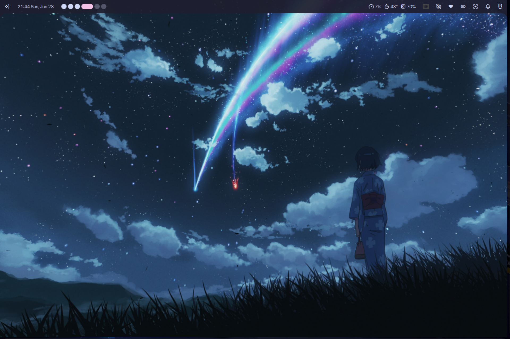
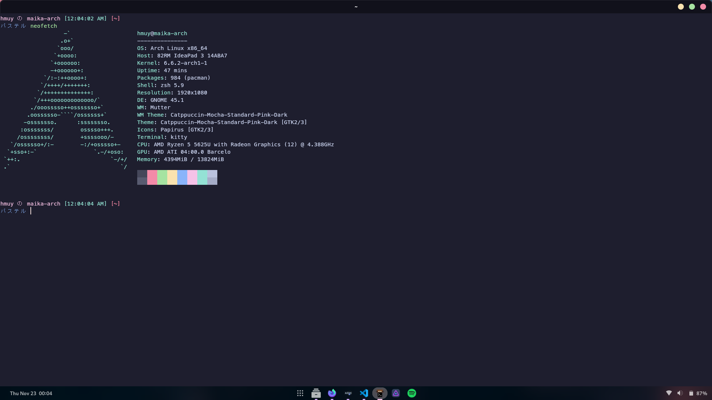

# dotfiles
## Info
- A place to dump my dotfiles.
## Usage
- idk copy the files manually lol
### Hyprland
- OS: Arch Linux
- WM: [hyprland](https://hyprland.org/)
- Launcher: [rofi](https://github.com/davatorium/rofi)
- Bar: [waybar](https://github.com/Alexays/Waybar) (based on [hypalando's waybar config](https://github.com/MizxGaming/Hypalando/tree/main/.config/waybar))
- GTK theme: [catppuccin-mocha-standard-pink-dark](github.com/catppuccin/gtk)
- Icons: [papirus-icon-theme](https://github.com/PapirusDevelopmentTeam/papirus-icon-theme) + [papirus-folders](https://github.com/catppuccin/papirus-folders)
- Wallpaper: [hyprpaper](https://github.com/hyprwm/hyprpaper) + [waypaper](https://github.com/anufrievroman/waypaper)
- Lock screen: [hyprlock](https://github.com/hyprwm/hyprlock)
- Audio: [pipewire](https://pipewire.org/) + [EasyEffects](https://github.com/wwmm/easyeffects)
- Shell: [zsh](https://www.zsh.org/) + [oh-my-zsh](https://ohmyz.sh/)
- Terminal: [kitty](https://sw.kovidgoyal.net/kitty/)
- All based on Catppuccin-Mocha colors!

### GNOME
- OS: Arch Linux + GNOME 45
- Theme: [catppuccin-mocha-standard-pink-dark](github.com/catppuccin/gtk)
- Icons: [papirus-icon-theme](https://github.com/PapirusDevelopmentTeam/papirus-icon-theme) + [papirus-folders](https://github.com/catppuccin/papirus-folders)
- [Wallpaper](https://github.com/Gingeh/wallpapers/blob/main/landscapes/evening-sky.png)


### Terminal (Kitty) and neofetch


## note to self

```
# install omz
    sh -c "$(curl -fsSL https://raw.githubusercontent.com/ohmyzsh/ohmyzsh/master/tools/install.sh)"
# get extensions
    git clone https://github.com/zsh-users/zsh-syntax-highlighting.git ${ZSH_CUSTOM:-~/.oh-my-zsh/custom}/plugins/zsh-syntax-highlighting
# catppuccin mocha
    wget https://raw.githubusercontent.com/catppuccin/zsh-syntax-highlighting/main/themes/catppuccin_mocha-zsh-syntax-highlighting.zsh -P ~/.oh-my-zsh/
# zsh-autosuggestions
    git clone https://github.com/zsh-users/zsh-autosuggestions ${ZSH_CUSTOM:-~/.oh-my-zsh/custom}/plugins/zsh-autosuggestions
    # zsh theme
    cp theming/candy_custom.zsh-theme ~/.oh-my-zsh/themes/
```    
