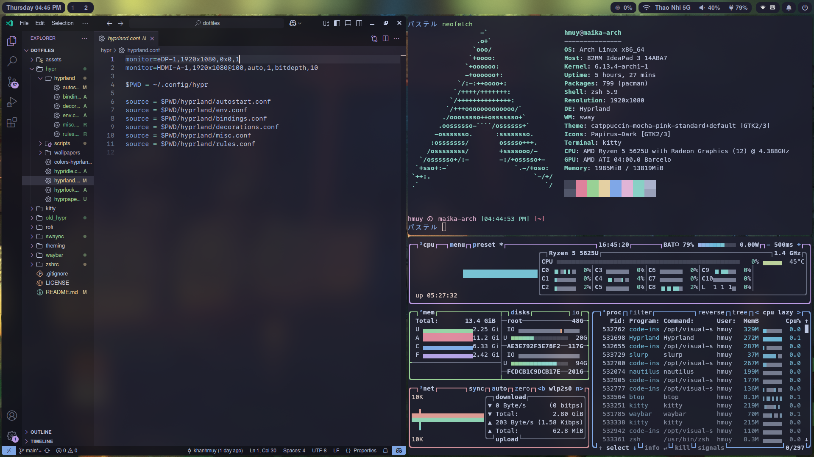
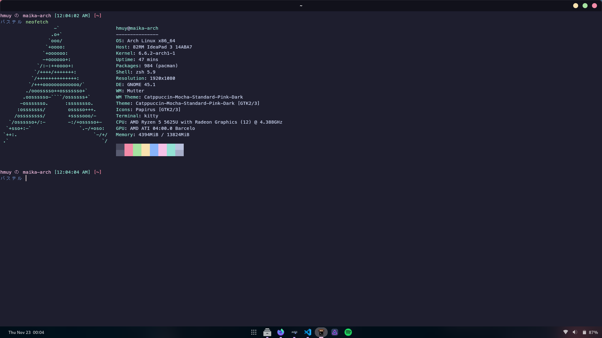

# dotfiles
## Info
- A place to dump my dotfiles.
## Usage
- idk copy the files manually lol
### Hyprland
- OS: Arch Linux
- WM: [hyprland](https://hyprland.org/)
- Launcher: [rofi](https://github.com/davatorium/rofi)
- Bar: [waybar](https://github.com/Alexays/Waybar) (based on [u1dm](https://github.com/u1dm/dotfiles)'s waybar config)
- Wallpaper: [swww](https://github.com/LGFae/swww) + [waypaper](https://github.com/anufrievroman/waypaper)
- Audio: [pipewire](https://pipewire.org/) + [EasyEffects](https://github.com/wwmm/easyeffects)
- Shell: [zsh](https://www.zsh.org/) + [oh-my-zsh](https://ohmyz.sh/)
- Terminal: [kitty](https://sw.kovidgoyal.net/kitty/)
- All based on Catppuccin-Mocha colors!

### GNOME
- OS: Arch Linux + GNOME 45
- Theme: [catppuccin-mocha-standard-pink-dark](github.com/catppuccin/gtk)
- Icons: [papirus-icon-theme](https://github.com/PapirusDevelopmentTeam/papirus-icon-theme) + [papirus-folders](https://github.com/catppuccin/papirus-folders)
- [Wallpaper](https://github.com/Gingeh/wallpapers/blob/main/landscapes/evening-sky.png)

### Terminal (Kitty) and neofetch
